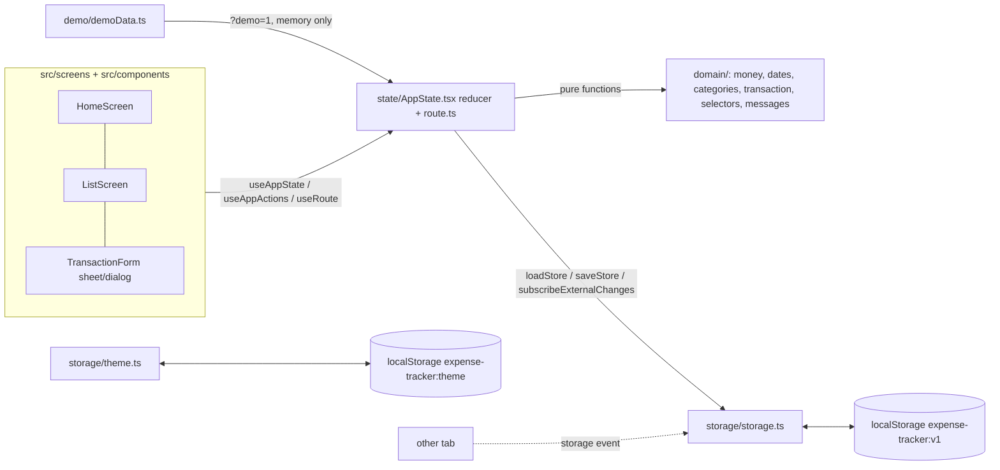

# SA Blueprint — Expense Tracker (แอปบันทึกรายรับรายจ่ายส่วนตัว)

Version 1.0 · 2026-10-09 · Stage 2 (SA) · Inputs: `docs/PRD.md` v1.0, `docs/IDEA.md`, `docs/DECISIONS.md`, `docs/STACK.md`
Contract (source of truth): `docs/contracts/modules.d.ts`. PRD amendments: A1–A9 — see `docs/pipeline/PRD_AMENDMENTS.md` for status; every use is marked `[PRD-AMEND An]`.

## Table of contents
| Section | Lines |
|---|---|
| 1. Stack | 23–51 |
| 2. Architecture | 53–70 |
| 3. Data model | 72–97 |
| 4. Module contracts | 99–113 |
| 5. Validation & error strategy | 115–130 |
| 6. Folder structure | 132–151 |
| 7. Testing strategy | 153–178 |
| 8. Security & privacy checklist | 180–189 |
| 9. Capacity & fit | 191–205 |
| 10. Traceability | 207–223 |
| 11. Acceptance verification | 225–241 |
| 12. Key decisions (ADR-lite) | 243–266 |
| 13. Operations: recovery & monitoring | 268–271 |

## 1. Stack
Client-only SPA, no backend (PRD §1, §7 Tech constraint; IDEA "ไม่ต้องมี login ไม่ต้องมี server"). STACK.md server parts skipped; its UI layer and Visual verification apply.
| Concern | Choice | Reason |
|---|---|---|
| Build | Vite (current major, ≥7) + TypeScript strict | Smallest mainstream SPA tooling; static output |
| UI | React 19 | Required by STACK.md UI layer (shadcn/ui) |
| Components | shadcn/ui in `src/components/ui` | STACK.md; Radix gives focus trap, Esc, aria (PRD §7 a11y) |
| CSS | Tailwind CSS v4 via `@tailwindcss/vite`; tokens as CSS variables in `src/index.css` | STACK.md |
| Icons | lucide-react only | STACK.md one family; category icons |
| Fonts | `@fontsource/<thai family>` (family picked in design: e.g. IBM Plex Sans Thai / Noto Sans Thai), `thai` + `latin` subsets, ≤3 weights, imported in `src/main.tsx` | Self-hosted (PRD §7 Privacy: no third-party requests) |
| Charts | None; plain CSS bars | US-11 is a simple bar list; saves ~100 KB vs recharts (PRD bundle ≤200 KB) |
| Toast | shadcn `sonner` | STACK.md list |
| State | React context + `useReducer` | 2 screens, one store; no library needed |
| Routing | Hash routes `#/`, `#/list` (`src/state/route.ts`, no dependency) | Back button works; static hosting needs no rewrites |
| Dates / money | `Intl.DateTimeFormat('th-TH-u-ca-buddhist')`, `Intl.NumberFormat('th-TH')`; integer satang | No date/money library needed |
| Storage | `localStorage` key `expense-tracker:v1` | PRD §5; size fits (§9) |
| Tests | Vitest + Testing Library + jsdom; Playwright E2E (Chromium + WebKit mobile) if browser install works, else Testing Library integration tests | STACK.md |
| Package manager | npm, Node LTS (22) | STACK.md |

Scaffold (repo root already holds `docs/`, so generate in a temp dir and copy; never use create-vite `--overwrite` here):
```
npm create vite@latest .scaffold -- --template react-ts   # then: cp -rn .scaffold/. . && rm -rf .scaffold
npm install && npm install -D tailwindcss @tailwindcss/vite
npx shadcn@latest init
npx shadcn@latest add button input textarea label dialog sheet alert-dialog toggle-group select sonner card badge alert
npm install lucide-react @fontsource/<family>
npm install -D vitest jsdom @testing-library/react @testing-library/user-event @testing-library/jest-dom @playwright/test @axe-core/playwright
```
Scripts: `dev`, `build` (`tsc -b && vite build`), `preview`, `test` (vitest run), `test:e2e` (playwright), `size` (gzip size of `dist/assets/*.js`), `demo` (= `vite --port ${DEMO_WEB_PORT:-3000}` and prints `http://localhost:<port>/?demo=1`). Not added from the STACK.md list: `table`, `tabs`, `dropdown-menu`, `tooltip` (no screen uses them); added: `textarea`, `label`, `alert-dialog`, `toggle-group`, `alert`.

## 2. Architecture

- Domain is pure TypeScript (no React, no storage) and holds all money/date/validation logic.
- Write path: action → build next array → `saveStore(next)` (one `setItem`) → on `{ok:true}` dispatch to reducer, close form, toast; on `{ok:false}` keep form open with `MESSAGES.saveFailed`. Submit button disabled while saving (double-tap).
- Derived values are `useMemo` over `transactions` + `selectedMonth` + `categoryFilter`; never stored.
- Form: `Sheet` (side bottom) below 640 px, `Dialog` from 640 px; default values recomputed on each open (`emptyDraft(new Date())`).

## 3. Data model
Single entity; no ER diagram needed. Types in `docs/contracts/modules.d.ts`.
| Field | Type | Constraint |
|---|---|---|
| id | string | UUID v4 built by `generateId()` from `crypto.getRandomValues` (works on plain-HTTP LAN hosts; `crypto.randomUUID` is secure-context only and never called), unique [PRD-AMEND A8] |
| type | `'income' \| 'expense'` | required |
| amount | integer satang | 1 ≤ amount ≤ 9,999,999,999 |
| categoryId | CategoryId | one of the 14 ids of PRD §5 and belongs to `type` |
| date | `YYYY-MM-DD` | real local calendar date, 2000-01-01..2099-12-31 [PRD-AMEND A3] |
| note | string | trimmed, ≤ 200 code points counted after trim [PRD-AMEND A7, A9]; rendered as text only |
| createdAt / updatedAt | ISO 8601 UTC string | set by `createTransaction` / `applyEdit` |

Storage keys:
| Key | JSON shape | Notes |
|---|---|---|
| `expense-tracker:v1` | `StoreV1 = { "version": 1, "transactions": Transaction[] }` | whole document rewritten on every change |
| `expense-tracker:v1:corrupt-<Date.now()>` | raw string as found | written when the main value is unparseable, wrong shape, unknown version, or has skipped records |
| `expense-tracker:theme` | `"light" \| "dark" \| "system"` | default `system` |
| `expense-tracker:probe` | `"1"` | written then removed by `probeStorage()` |

- **Schema version / migrations:** `version` is checked on load. A future `v2` adds `migrate(v1)→v2` in `storage.ts` and writes `expense-tracker:v2` after keeping the v1 value until the first successful v2 write. Unknown versions are backed up, not discarded.
- **Seed / demo:** normal use starts empty. `?demo=1` loads `generateDemoTransactions(now)` into memory only (3 months, every category, a negative-balance month, long + emoji notes, 0.1 + 0.2 entries); storage is never read or written in demo mode, so real data is untouched.
- **Corrupt handling:** copy raw value to the backup key first; only if that write succeeds, rewrite the main key (empty, or valid records only) so a reload does not create another backup. If the backup write fails, leave the main key untouched and run as `unavailable` (memory only) so raw data is never overwritten.
- **Delete:** hard delete (PRD US-04 "ไม่สามารถกู้คืนได้"); no soft delete.
- **Time zone / calendar:** `date` is a local calendar date with no time zone; month = `date.slice(0,7)`; no `Date` parsing of stored dates except `new Date(y, m-1, d)` for formatting. Display uses Buddhist Era via `th-TH-u-ca-buddhist`. Timestamps are UTC ISO and only order items within a day.
- **Integer safety:** sums stay below `Number.MAX_SAFE_INTEGER` up to ~900,000 maximum-value entries.

## 4. Module contracts
Machine-readable: `docs/contracts/modules.d.ts` (checked by `node docs/pipeline/templates/check-contract.mjs . docs`). UI components are internal and consume only these exports.
| Operation | Function (module) | Serves | Notes |
|---|---|---|---|
| Category list / lookup | `CATEGORIES`, `categoriesForType`, `getCategory`, `isCategoryOfType` (domain/categories) | US-01, 07, 08, 11 | fixed 14; icon names final in design |
| Parse / format money | `parseAmountInput`, `formatBaht`, `formatSignedAmount`, `satangToInputText` (domain/money) | US-02, 03, 05, 07, 08, 10 | no floats; U+2212 minus [PRD-AMEND A4] |
| Dates | `todayLocal`, `currentMonth`, `addMonths`, `formatMonthTh`, `formatDayHeadingTh`, `isValidDateString`, `monthOf` (domain/dates) | US-01, 02, 05, 06, 07 | [PRD-AMEND A1, A3] |
| Form logic | `emptyDraft`, `draftFromTransaction`, `validateDraft`, `limitNoteInput`, `generateId`, `createTransaction`, `applyEdit`, `isValidTransaction` (domain/transaction) | US-01, 02, 03, 12 | all field errors at once + first invalid; note limit after trim [PRD-AMEND A9]; ids via `getRandomValues` [PRD-AMEND A8] |
| Derived views | `inMonth`, `sortNewestFirst`, `summarize`, `expenseByCategory`, `recent`, `groupByDay`, `filterByCategory`, `filteredTotal` (domain/selectors) | US-05, 07, 08, 10, 11 | [PRD-AMEND A2, A5, A6] |
| Messages | `MESSAGES` (domain/messages) | US-01, 02, 04, 05, 07, 08, 10, 12 | exact PRD Thai strings |
| Persist | `STORAGE_KEY`, `CORRUPT_KEY_PREFIX`, `probeStorage`, `loadStore`, `saveStore`, `subscribeExternalChanges` (storage/storage) | US-01, 03, 04, 09, 12 | atomic whole-document write |
| Theme | `THEME_KEY`, `loadThemePreference`, `applyThemePreference` (storage/theme) | US-09 (PRD §7 Theme) | no dedicated story |
| App state | `AppProvider`, `useAppState`, `useAppActions` (state/AppState) | US-01, 03–09, 11, 12 | month + filter shared, reset on reload |
| Routing | `useRoute`, `navigate` (state/route) | US-05, 07, 11 | `navigate` never touches the filter; the caller runs `setCategoryFilter` first: "ดูทั้งหมด" → `'all'` [PRD-AMEND A5], US-11 row → that category |
| Demo data | `generateDemoTransactions` (demo/demoData) | US-05, 07, 08, 11 | `?demo=1` only; also 5,000-row perf fixture |

## 5. Validation & error strategy
All rules run client-side in `domain/` (there is no server or database); the UI only displays results.
| Rule (PRD) | Enforced in | User sees |
|---|---|---|
| Amount empty/format/≤0, >2 decimals, >max; one message per field in that order (US-02, §6 commas) | `parseAmountInput` via `validateDraft` | message under the field, `aria-describedby`; [PRD-AMEND A4] |
| Category missing or not of `type` (US-02, US-01 type switch) | `validateDraft`; type switch calls `isCategoryOfType` and clears | "กรุณาเลือกหมวดหมู่" |
| Date empty/invalid/out of range (US-02) | `isValidDateString`; `<input type="date" min="2000-01-01" max="2099-12-31">` | "กรุณาเลือกวันที่" [PRD-AMEND A3] |
| Note ≤200 (US-02) | limit applies **after trim**: on every input/paste `limitNoteInput(raw)` keeps the raw text (leading/trailing spaces stay while typing) unless `trim(raw)` exceeds 200 code points, then cuts to leading spaces + the first 200 code points of the trimmed text; `validateDraft` trims and re-checks | counter "n/200" = code points of `trim(raw)`; spaces at the ends never count or cause a cut [PRD-AMEND A7, A9] |
| Several errors (US-02) | `validateDraft` returns all + `firstInvalid` | all messages, focus first invalid (amount → category → date → note) |
| Double submit (§6) | button `disabled` while `saving` | one record |
| Storage blocked (US-12) | `probeStorage()` at start | persistent banner `storageUnavailable`; app works in memory |
| Write fails (US-12) | `saveStore` catches `QuotaExceededError`/other | form stays open with data; `saveFailed` under the form (role=alert) |
| Corrupt data (US-12) | `loadStore` | banner `storageCorrupt`; empty list; raw copied to corrupt key |
| Some bad records (US-12) | `isValidTransaction` per record | valid ones load; raw backed up silently (no PRD message) |
| Other tab writes (§6) | `subscribeExternalChanges` | lists refresh; open form stays open; last write wins |
| Unexpected render error | top-level React error boundary | "เกิดข้อผิดพลาด" + reload button; data untouched |

## 6. Folder structure
```
index.html                    lang="th", CSP meta injected at build (§8)
package.json  vite.config.ts  tsconfig*.json  components.json  eslint.config.js  playwright.config.ts
src/
  main.tsx                    fontsource imports, theme init, <AppProvider><App/></AppProvider>
  App.tsx                     layout, header (month switcher, theme toggle, desktop add button), bottom nav, FAB, routes
  index.css                   @import "tailwindcss"; design tokens (light/dark CSS variables), resets only
  domain/                     types.ts messages.ts categories.ts money.ts dates.ts transaction.ts selectors.ts (+ *.test.ts)
  storage/                    storage.ts theme.ts (+ *.test.ts)
  state/                      AppState.tsx route.ts
  demo/                       demoData.ts
  screens/                    HomeScreen.tsx ListScreen.tsx
  components/                 MonthSwitcher SummaryCards ExpenseBreakdown TransactionList TransactionRow
                              TransactionForm CategoryChips CategoryFilter StorageBanner ThemeToggle EmptyState BottomNav PrivacyNote
  components/ui/              shadcn/ui generated components
  lib/utils.ts                shadcn `cn`
tests/e2e/                    *.spec.ts (Playwright)
docs/                         pipeline docs (unchanged)
```

## 7. Testing strategy
| Layer | Tool | What |
|---|---|---|
| Unit (domain) | Vitest | every `parseAmountInput` case in US-02/§6 (150, "1,250.50", 0, -5, abc, 10.555, 0.001, 0.00, 99999999.99, 100000000); `formatBaht` (12,499.50, −฿500.00, ฿0.00); `summarize` with 0.1+0.2 → 30 satang; `expenseByCategory` order + half-up percent; `groupByDay`/`sortNewestFirst`; month edges (Feb 29 2028, day 31, Dec→Jan); `formatDayHeadingTh('2026-10-07')` = "พ. 7 ต.ค. 2569"; `formatMonthTh('2026-10')` = "ตุลาคม 2569"; note 200 code points with Thai marks and emoji |
| Unit (storage) | Vitest + jsdom, stubbed `localStorage` | round trip; probe failure; quota error → `{ok:false,'quota'}`; unparseable / wrong shape / version 2 → backup key + corrupt; mixed valid/invalid → valid only + backup; `storage` event reload |
| Component | Testing Library | form defaults, type switch clears category, all-errors + focus, edit prefill, delete confirm/cancel, filter + "ล้างตัวกรอง", empty states, banners |
| E2E | Playwright, 390×844 and 1440×900 | F1–F6 flows; reload persistence; second tab sync; no network requests after load (US-09); keyboard-only add/edit/delete with Esc; 360 px no horizontal scroll |
| Perf | Playwright + 5,000-row fixture (`generateDemoTransactions(now, 5000)` written to storage) | month switch / filter / save ≤100 ms (Performance API marks) |
| Visual | `docs/pipeline/templates/screenshot.mjs` on `/?demo=1` | 1440/390 × light/dark |

Amended behaviors, one named test each (qa-agent writes all of them):
| Amend | Behavior | Layer | Case → expected |
|---|---|---|---|
| A2 | Month with no expenses hides the breakdown | unit + component | `expenseByCategory` of an income-only month and of an empty month → `[]`; HomeScreen for that month renders neither the breakdown heading nor its list |
| A3 | Date range bounds | unit | `isValidDateString`: `2000-01-01`, `2099-12-31` → true; `1999-12-31`, `2100-01-01`, `2026-02-30` → false |
| A3 | Picker limits | component | date input has `min="2000-01-01"` and `max="2099-12-31"` |
| A3 | Out-of-range date on save | component | draft date `2100-01-01` + save → nothing saved, "กรุณาเลือกวันที่" under the date field, focus on date when it is the first invalid field |
| A5 | Home list order and limit | unit | `recent` with 7 items incl. two on the same date with different `createdAt` → 5 items, date desc then createdAt desc (same order as `groupByDay`) |
| A5 | "ดูทั้งหมด" resets the filter | component + E2E | on list set filter "อาหาร", go home, tap "ดูทั้งหมด" → list route, same month, filter "ทุกหมวด", all items of the month shown |
| A5 | Empty selected month on home | component + E2E | data only in the previous month, current month selected → three totals "฿0.00", "ไม่มีรายการในเดือนนี้" in place of the list, no "ดูทั้งหมด" link |
| — | US-11 row sets its category | component + E2E | tap the "อาหาร" breakdown row → list route with filter "อาหาร" |
| A8 | Ids without `crypto.randomUUID` | unit | with `crypto.randomUUID` stubbed to `undefined`, `generateId()` returns `/^[0-9a-f]{8}-[0-9a-f]{4}-4[0-9a-f]{3}-[89ab][0-9a-f]{3}-[0-9a-f]{12}$/`; 10,000 calls → 10,000 distinct ids |
| A8 | Add entry in a non-secure context | E2E | `page.addInitScript(() => { Reflect.deleteProperty(Crypto.prototype, 'randomUUID') })` then add an entry → saved, listed, survives reload |
| A9 | Note limit after trim | unit | `limitNoteInput('  ' + 'ก'.repeat(200) + '  ')` unchanged (counter 200); `limitNoteInput('  ' + 'ก'.repeat(201))` → `'  ' + 'ก'.repeat(200)`; 199 letters + `' x'` → cut to 199 letters + `' '` (inner space counts); 200 emoji → kept, counter 200 |

Test data: demo generator (deterministic), empty storage, corrupt string `"{not json"`, `{version:2}`, 5,000-row fixture, an income-only month, a store with data only in the previous month.

## 8. Security & privacy checklist
- **Roles × actions:** one role (owner of the browser) may add/view/edit/delete everything; no server, so nothing to enforce server-side. N/A — single-user local app (PRD §2).
- **Input validation:** all inputs validated in `domain/` before write and again on load (`isValidTransaction`); no file uploads — N/A.
- **Personal data:** amounts, categories, dates, notes (may contain personal text). Stored only in this browser's localStorage; retained until the user deletes items or clears browser data; nothing is logged or sent. In-page notice `MESSAGES.privacyNote` (PRD §7).
- **XSS:** notes rendered as React text only; `dangerouslySetInnerHTML` forbidden (lint rule `react/no-danger`).
- **Authentication:** N/A — no accounts, sessions, passwords or rate limits (PRD non-goals).
- **Secrets:** none; no env vars needed. N/A.
- **CSP / origins:** production build injects `<meta http-equiv="Content-Security-Policy" content="default-src 'self'; script-src 'self'; style-src 'self' 'unsafe-inline'; img-src 'self' data:; font-src 'self'; connect-src 'none'; object-src 'none'; base-uri 'self'; form-action 'none'">` (`connect-src 'none'` enforces US-09). CORS N/A (no API).
- **Dependencies:** lockfile committed; `npm audit --omit=dev` in CI; runtime deps only react, react-dom, radix (via shadcn), sonner, lucide-react, clsx/tailwind-merge, fontsource.
- **Backup/restore:** N/A on a server; see §13.

## 9. Capacity & fit
Target machine not stated (idea predates intake template) → assumed: mid-range phone browser (PRD §7 browsers), static files from any static host, **including plain HTTP on a LAN address** (e.g. a Raspberry Pi per STACK.md at `http://<lan-ip>`), which is not a secure context; logged in DECISIONS.
| Item | Estimate |
|---|---|
| Record size | ~240 UTF-16 units (measured, 26-char note); ~420 with a 200-char note; use 260 average |
| Volume / year | heavy use 10/day = 3,650 rows × 260 ≈ 0.95 M units (~1.9 MB as UTF-16) |
| PRD perf set | 5,000 rows ≈ 1.3 M units |
| Quota | localStorage ~5 M UTF-16 units per origin (Chrome/Firefox/Safari); IndexedDB not needed |
| Headroom | ~5 years of heavy use; save = `JSON.stringify` of 1.3 MB ≈ 10–20 ms on a mid phone, inside 100 ms |
| JS bundle (gzip) | React+DOM ~60 KB, Radix parts ~25 KB, sonner ~10 KB, lucide (tree-shaken) ~5 KB, app ~20 KB → ~120 KB of 200 KB |
| Fonts | Thai+Latin subsets, ≤3 weights, woff2 ~30–60 KB each, `font-display: swap` |
| Users / CPU arch | 1 user per browser; static files are architecture-independent (any host incl. arm64 Pi) |
| Secure context | Not required: no secure-context-only API is used (ids via `crypto.getRandomValues` [PRD-AMEND A8]; no `crypto.randomUUID`, `crypto.subtle`, Clipboard API or service worker); `localStorage`, `Intl`, `storage` events work on `http://<lan-ip>`. HTTPS stays optional for devops |

Verdict: FITS (watch: storage above 3 M units ≈ 11,000 rows → move to IndexedDB; bundle checked by `npm run size`).

## 10. Traceability
| US | Entities | Modules | Screens | Verified by |
|---|---|---|---|---|
| US-01 | Transaction | transaction, categories, dates, storage, AppState | Form, Home | component + E2E F1; §7 A8 rows; §11 #2, #13 |
| US-02 | Transaction | money, dates, transaction, messages | Form | unit (parse/validate) + component; §7 A3, A9 rows; §11 #3 |
| US-03 | Transaction | transaction, money, storage, AppState | Form, List, Home | component + E2E F2 |
| US-04 | Transaction | storage, AppState, messages | Form + AlertDialog | component + E2E F3 |
| US-05 | Transaction (derived) | selectors, money, messages, route, AppState | Home | unit (summarize, recent) + component + E2E; §7 A5 rows; §11 #4 |
| US-06 | UI state | dates, AppState | Home, List | unit (addMonths/format) + E2E |
| US-07 | Transaction | selectors, dates, money | List | unit (groupByDay) + E2E |
| US-08 | UI state | selectors, categories | List | component + E2E |
| US-09 | StoreV1 | storage, theme | all | E2E reload + network check; §11 #5–6 |
| US-10 | — | selectors, messages | Home, List | component + E2E empty storage |
| US-11 | Transaction (derived) | selectors, route, AppState | Home | unit (expenseByCategory) + component + E2E; §7 A2 row and "US-11 row sets its category" |
| US-12 | StoreV1, corrupt key | storage, messages | Banner, Form | unit (storage) + E2E with seeded corrupt value |

Uncovered stories: none

## 11. Acceptance verification (definition of done)
The idea has no `เกณฑ์ผ่าน` section; rows come from the PRD's measurable criteria (§7, §8).
| # | Criterion | How measured | Expected |
|---|---|---|---|
| 1 | All stories' Given/When/Then (with A1–A9 as amended) | Vitest + Playwright suites, §7 incl. the amended-behavior table | 100% pass |
| 2 | Typical add ≤4 taps after the form opens, ≤10 s | Playwright at 390×844: count clicks/taps (amount typing excluded) for amount + category + save | ≤4 interactions |
| 3 | First entry by a new user within 30 s | Proxy (see DECISIONS DEVIATION): Playwright from empty storage: first visible action is "เพิ่มรายการ"; flow completes in ≤5 interactions with no hidden controls | pass; human test 3–5 users optional |
| 4 | Totals correct 100% incl. decimals | unit: 0.1+0.2 = ฿0.30; US-05 example ฿20,000.00/฿7,500.50/฿12,499.50; random 1,000-row property test vs BigInt sum | exact |
| 5 | Data kept after reload in every supported browser | Playwright Chromium, Firefox, WebKit (iOS profile): add/edit/delete → reload → compare | identical |
| 6 | No network requests for data (US-09) | Playwright: record requests after load while adding/editing/deleting | 0 requests |
| 7 | LCP ≤2.5 s mobile 4G | Lighthouse CLI mobile preset on `vite preview` build | ≤2.5 s |
| 8 | Lighthouse mobile Accessibility ≥95, Performance ≥90 | same run | ≥95 / ≥90 |
| 9 | Month switch / filter / save ≤100 ms with 5,000 rows | Playwright with 5,000-row fixture, Performance marks around action → next paint | ≤100 ms each |
| 10 | JS bundle ≤200 KB gzip | `npm run build && npm run size` | ≤200 KB |
| 11 | No horizontal scroll at 360 px; works 360–1440 px | Playwright at 360, 390, 1440: `scrollWidth <= clientWidth` | true |
| 12 | Contrast ≥4.5:1, labels, aria-describedby, keyboard, focus trap, 44×44 targets, `lang="th"` | `@axe-core/playwright` on every screen in light + dark; keyboard E2E; target-size check script | 0 axe violations; all pass |
| 13 | Works when served over plain HTTP on a LAN host (not a secure context) [PRD-AMEND A8] | E2E "Add entry in a non-secure context" (§7); `grep -rnE --exclude='*.test.*' 'randomUUID\(\|crypto\.subtle\|navigator\.clipboard\|serviceWorker' src` | entry saved and reloaded; 0 grep hits |

## 12. Key decisions (ADR-lite)
ADR-1 Client-only SPA, no backend — status: accepted
Decision: Vite + React + TypeScript static app, all logic in the browser.   Why: PRD §1/§7 and IDEA (no login, no server, single user).
Rejected: STACK.md monorepo (Next.js + NestJS + PostgreSQL) — needs a server the PRD excludes.
Revisit when: multi-device sync, multiple users, or cloud backup is requested.
Consequences: free static hosting, no ops; data lives and dies with one browser profile; only APIs that work outside a secure context are used (ids via `crypto.getRandomValues`, not `crypto.randomUUID` [PRD-AMEND A8]), so plain `http://<lan-ip>` hosting (e.g. a Pi) works without HTTPS.

ADR-2 localStorage, one JSON document, versioned — status: accepted
Decision: `expense-tracker:v1` holds `{version, transactions[]}`, rewritten whole on each change.   Why: PRD §5; ~1.3 M units for 5,000 rows fits the ~5 M quota; one `setItem` gives the atomic write PRD §7 asks for.
Rejected: IndexedDB — async API and more code with no need at this size.
Revisit when: stored size passes 3 M UTF-16 units (~11,000 rows) or save time exceeds 50 ms on the perf fixture.
Consequences: simple sync load/save; whole-document rewrite cost grows linearly.

ADR-3 Money as integer satang, parsed from strings — status: accepted
Decision: amounts are integers in satang end to end; parsing never uses float math.   Why: PRD §5 and the 0.1+0.2 = ฿0.30 rule.
Rejected: float baht + rounding — rounding drift in sums.
Revisit when: multi-currency is added (PRD non-goal today).
Consequences: every display goes through `formatBaht`; inputs need a converter.

ADR-4 shadcn/ui + Tailwind v4 + CSS-only bars, no router or chart library — status: accepted
Decision: STACK.md UI layer on Vite; hash routing and US-11 bars hand-rolled.   Why: STACK.md mandates shadcn; PRD bundle ≤200 KB and only a simple bar list.
Rejected: recharts / react-router — ~100 KB / ~20 KB gzip for one bar list and two routes.
Revisit when: more than 3 routes or a real chart (trend, multi-month) is requested.
Consequences: a11y comes from Radix; small bundle; routes are maintained by hand.

## 13. Operations: recovery & monitoring
- **Backup:** N/A — no server or export (PRD non-goal; Q4 open). Clearing browser data loses everything; logged in DECISIONS. Only automatic copy: the `corrupt-*` key written when data cannot be read.
- **Restore:** N/A for users. For support: open DevTools → Application → Local Storage, copy the newest `expense-tracker:v1:corrupt-*` value, fix it, paste into `expense-tracker:v1`, reload; verify the item count in the list. RPO/RTO: N/A (single-device data, no copy exists).
- **Monitoring:** N/A for the app — no analytics or error reporting (PRD §7 Privacy forbids third-party requests). Host health = HTTP 200 for `/index.html` on the static host (devops). Nothing is logged in the console except development warnings; notes and amounts are never logged.
