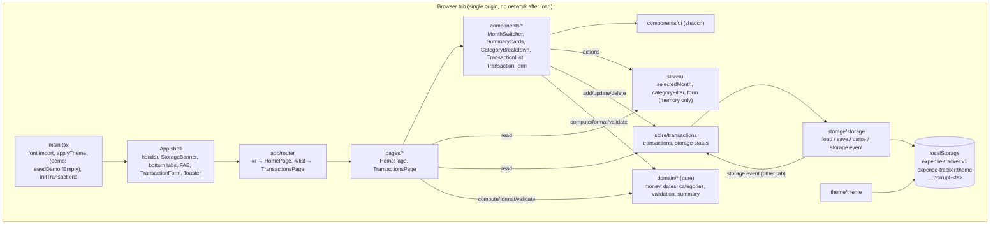
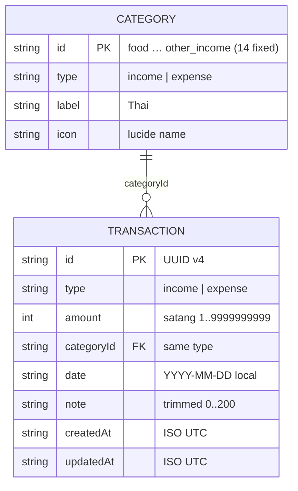

# SA Blueprint: Expense Tracker (แอปบันทึกรายรับรายจ่ายส่วนตัว)

Version 1.0 · 2026-10-07 · Stage 2 (SA) · Inputs: `docs/PRD.md` v1.0, `docs/IDEA.md`, `docs/DECISIONS.md`, `docs/STACK.md`
Contract (source of truth): `docs/contracts/modules.d.ts` · checker: `node docs/pipeline/templates/check-contract.mjs . docs` → `contract ok: 12 stories served, 0 declared uncovered`

## Table of contents
| Section | Lines |
|---|---|
| 0. Inputs, gaps and resolved PRD ambiguities | 24–39 |
| 1. Stack | 41–74 |
| 2. Architecture | 76–107 |
| 3. Data model | 109–143 |
| 4. Module contracts | 145–166 |
| 5. Validation & error strategy | 168–186 |
| 6. Folder structure | 188–219 |
| 7. Testing strategy | 221–230 |
| 8. Security & privacy checklist | 232–244 |
| 9. Capacity & fit | 246–262 |
| 10. Traceability | 264–281 |
| 11. Acceptance verification (definition of done) | 283–305 |
| 12. Key decisions (ADR-lite) | 307–342 |
| 13. Operations: recovery & monitoring | 344–347 |

## 0. Inputs, gaps and resolved PRD ambiguities
The idea file predates the intake template. It has no `Tech stack & ข้อจำกัด`, no `เซิร์ฟเวอร์และการ deploy` and no `เกณฑ์ผ่าน` section. Treated as "not stated":
- **Stack:** not stated. The idea says "ไม่ต้องมี login ไม่ต้องมี server", so the app is client-only (STACK.md client-only rule). See ADR-1.
- **Server/machine:** not stated, and none is needed. The runtime is the user's own phone/desktop browser; the build output is static files. Assumed reference device for the numbers in §9: a mid-range Android phone (Chrome, 4 GB RAM, 4G), which matches PRD §7 Performance.
- **Acceptance (`เกณฑ์ผ่าน`):** not stated. §11 uses the measurable criteria in PRD §7 and §8 instead.

The PRD went to this stage with Gate 1 review findings still open (`docs/pipeline/REVIEW_G1.md`). This blueprint fixes one behavior for each of them so the contract and tests are deterministic. Each is logged in `docs/DECISIONS.md`. The PRD text itself is unchanged.
| Review item | Resolution used by dev and QA |
|---|---|
| B1: US-07 example "อ. 7 ต.ค. 2569" has the wrong weekday | The heading comes from `Intl.DateTimeFormat('th-TH-u-ca-buddhist', {weekday:'short', day:'numeric', month:'short', year:'numeric'})` on the local date. 2026-10-07 renders "พ. 7 ต.ค. 2569" (verified with Node 22 ICU). Tests use that string. |
| B2: US-11 "hide section, or show text" | The section stays on screen and shows "ยังไม่มีรายจ่ายในเดือนนี้" when the month has entries but no expenses. On first run with no entries at all, the US-10 empty state replaces the breakdown and the recent list. |
| N2: out-of-range dates | A date outside 2000-01-01..2099-12-31, or not a real date, shows "กรุณาเลือกวันที่". ◀/▶ navigation is unlimited (US-06), and months outside the range are simply empty. |
| N3: amount message precedence | invalid (empty, not a number, negative) → decimals > 2 → zero → too large. "0.001" → "ทศนิยมได้ไม่เกิน 2 ตำแหน่ง". "0" → "กรุณากรอกจำนวนเงินมากกว่า 0". |
| N4: home "latest" ordering | Same as US-07: date desc, then createdAt desc. |
| N5: percent rounding | `Math.round` (half-up for positive values). Rows are not forced to sum to 100. |
| N6: home for a month with no entries | Totals ฿0.00, the breakdown text above, and the recent list shows "ไม่มีรายการในเดือนนี้". |

## 1. Stack
Client-only single-page app. No backend, no database server, no auth (PRD §1 non-goals, §7 Tech constraint).
| Layer | Choice | Why |
|---|---|---|
| Runtime / package manager | Node 22 LTS, npm | Matches STACK.md, and Node 22 is on the build machine |
| Build | Vite 8 (`create-vite` 9.x, template `react-ts`) | Smallest mainstream SPA tool; static output |
| UI | React 19 + TypeScript (strict) | STACK.md UI layer requires React + shadcn/ui |
| Components | shadcn/ui (Radix) in `src/components/ui` | STACK.md UI layer: every button, input, select, dialog and sheet comes from here |
| CSS | Tailwind CSS 4 via `@tailwindcss/vite`; tokens in `src/index.css` | STACK.md: tokens and resets only in the global stylesheet |
| Icons | lucide-react (one family) | STACK.md; each category icon is picked from it in the design stage |
| Font | `@fontsource-variable/noto-sans-thai` (default; the design doc may name another Thai-capable `@fontsource` family) | Self-hosted, so no third-party request (PRD §7 Privacy) |
| Toasts | sonner (via `shadcn add sonner`) | "บันทึกแล้ว"/"ลบแล้ว"; the generated file must use our `useTheme`, not `next-themes` |
| Charts | None. US-11 bars are plain CSS `div` widths | STACK.md allows CSS bars for a simple bar list; saves about 90 KB gzip |
| State | 2 tiny `useSyncExternalStore` stores, no library | Only 2 routes and 3 pieces of state (ADR-4) |
| Routing | Hash routing (`#/`, `#/list`), about 20 lines, no library | Works on any static host without rewrites (ADR-4) |
| Storage | `localStorage`, one JSON key with a schema version | PRD §5; size fits (§9, ADR-2) |
| Unit/component tests | Vitest 5 + jsdom + @testing-library/react + user-event + jest-dom | STACK.md test tools |
| E2E / a11y | @playwright/test 1.6x + @axe-core/playwright; `docs/pipeline/templates/screenshot.mjs` for screenshots | STACK.md; if the browser install fails, QA falls back to component tests and records which checks did not run |

**Scaffold (run at the project root, non-interactive):**
```
npm create vite@latest .scaffold -- --template react-ts --no-interactive --no-immediate
cp -rn .scaffold/. . && rm -rf .scaffold      # NEVER use --overwrite at the root: it deletes docs/
npm install
npm install tailwindcss @tailwindcss/vite lucide-react @fontsource-variable/noto-sans-thai
# tsconfig.json + tsconfig.app.json: "baseUrl": ".", "paths": { "@/*": ["./src/*"] }
# vite.config.ts: plugins [react(), tailwindcss()], resolve.alias { "@": "/src" }; src/index.css: @import "tailwindcss";
npx shadcn@latest init -d
npx shadcn@latest add button input textarea label select dialog sheet alert-dialog toggle-group tabs card badge dropdown-menu sonner
npm install -D vitest jsdom @testing-library/react @testing-library/user-event @testing-library/jest-dom @playwright/test @axe-core/playwright
```
`table` and `tooltip` from the STACK.md add list are left out because no screen has a table or a tooltip.
**npm scripts:** `dev` (vite), `build` (`tsc -b && vite build`), `preview`, `test` (`vitest run`), `e2e` (`playwright test`), `check:bundle` (`node scripts/check-bundle.mjs`, fails above 200 KB gzip JS), `demo` (`node scripts/demo.mjs`: runs `vite --mode demo --port ${DEMO_WEB_PORT:-3000} --strictPort`, then prints the URL and "no accounts (no login)"). `DEMO_API_PORT` is ignored because there is no API.
`.gitignore`: add `docs/pipeline/node_modules`, `dist`, `test-results`, `playwright-report`.

## 2. Architecture

- **Rules:** `domain/*` is pure: no React, no storage, no `Date.now()` without an injectable `now`. Only `storage/storage` touches `localStorage`. Components never call storage directly.
- **Derived values** (totals, breakdown, groups) are computed in pages with `useMemo` over `transactions` + `selectedMonth` + `categoryFilter`. Nothing derived is stored (PRD §5).
- **Write path:** form → `validateDraft` → `addTransaction`/`updateTransaction` → build the next array → `saveTransactions` (one `setItem`) → on success swap the in-memory array and notify; on failure leave the state unchanged and return `storage-failed`.
- **Multi-tab:** a `storage` event for `expense-tracker:v1` re-runs `loadTransactions()` and replaces the state (last write wins). If the edit form is open on a record that no longer exists, saving returns `not-found`; the form closes with toast "ลบแล้ว" and does not create a record.
- **Midnight:** `todayISO()` is called each time the add form opens (PRD §6), and `currentYearMonth()` each time "เดือนนี้" is pressed.

## 3. Data model
One stored entity (`Transaction`) plus a fixed in-code list (`Category`). Storage is client-only, so the "schema" is the JSON envelope below; the TypeScript shapes are in `docs/contracts/modules.d.ts` (`@/domain/types`).

**Storage keys**
| Key | Value | Written when |
|---|---|---|
| `expense-tracker:v1` | `{"version":1,"transactions":[Transaction…]}` (array order not significant) | every add/edit/delete: whole envelope, one `setItem` |
| `expense-tracker:theme` | `"light"` \| `"dark"` \| `"system"` (missing = system) | theme toggle |
| `expense-tracker:v1:corrupt-<Date.now()>` | the raw unreadable string, untouched | startup, when the main key cannot be read or some records were skipped |
| `expense-tracker:probe` | `"1"`, removed right away | startup availability check |

Example record: `{"id":"6f1c…","type":"expense","amount":15000,"categoryId":"food","date":"2026-10-07","note":"ข้าวกลางวัน","createdAt":"2026-10-07T05:12:45.123Z","updatedAt":"2026-10-07T05:12:45.123Z"}`

**Categories** (fixed, PRD §5 order, which is also the tie-break order): expense `food, transport, shopping, bills, housing, health, entertainment, education, other_expense`; income `salary, bonus, sales, gift, other_income`. Labels are as in PRD §5. A record whose `categoryId` is unknown or of the wrong type is invalid and is skipped on load.

**Record validity on load** (`isValidTransaction`): `id` is a non-empty string not seen before; `type` is in the enum; `amount` is an integer in 1..9_999_999_999; `categoryId` matches `type`; `date` passes `isValidISODate`; `note` is a string of at most 200 characters; `createdAt`/`updatedAt` are strings that `Date.parse` accepts.

**Migration / versioning**
- `version` is required. `version === 1` → parse. Missing, non-numeric or any other version → unreadable (US-12 path: back up raw, start empty).
- A future v2 adds `migrate(v1) → v2` in `storage.ts`, writes it back under a new key `expense-tracker:v2`, and keeps `v1` until the first successful v2 write. Changes are additive, and old keys are never deleted in the same release that stops reading them.
- **Unreadable data:** copy the raw string to `…:corrupt-<ts>`, then write an empty v1 envelope, so the next start does not back up again. If that copy throws (quota), do not touch the main key and run in memory-only mode with status `unavailable`, so no data is ever destroyed.
- **Partly invalid data** (some records skipped): load the valid ones and silently copy the raw string to a corrupt key once, because the next save would drop the skipped records. There is no banner (PRD gives none). The copy keeps them recoverable.

**Delete:** hard delete (PRD US-04 "ไม่สามารถกู้คืนได้"). No soft-delete flag and no undo.

**Time and calendar:** `date` is a local calendar date string. It is never converted to a `Date` with a time zone for storage. Parse it with `new Date(y, m-1, d)` and never with `new Date("YYYY-MM-DD")`, which is UTC. Month membership is `date.startsWith(ym)`. Display uses the Buddhist era via `th-TH-u-ca-buddhist` ("ตุลาคม 2569", "พ. 7 ต.ค. 2569"). `createdAt`/`updatedAt` are UTC ISO and used only for ordering.

**Money:** integer satang only. Parsing uses string arithmetic. Sums are integer additions; 5,000 × the maximum amount = 5e13, which is below 2^53. Formatting: integer baht part grouped with `toLocaleString('en-US')` + `.` + two-digit satang. The sign is "−" (U+2212) for negatives and "+" for income rows. Do not use `Intl` currency formatting, which emits a hyphen-minus.

**Seed/demo:** real users start empty. `npm run demo` (Vite `MODE === 'demo'`) dynamically imports `@/demo/demoData` and calls `seedDemoIfEmpty()` before `initTransactions()`. The import is dead-code-eliminated from production builds. The set is deterministic for a given `now` and is idempotent (it writes only when the key is absent). Contents are in the contract JSDoc. To reset it, clear the site data for the demo origin. QA perf data (5,000 records) is generated in the tests and never shipped.

## 4. Module contracts
Machine-readable source of truth: **`docs/contracts/modules.d.ts`** (TypeScript declarations per module, each export tagged `@stories`). Summary:
| Operation | Function (module) | Serves | Notes |
|---|---|---|---|
| Parse amount text | `parseAmount` (`@/domain/money`) | US-01, US-02 | string → satang; error precedence §0 N3 |
| Format money | `formatTHB`, `formatTransactionAmount`, `satangToInputText` (`@/domain/money`) | US-03, US-05, US-07, US-08, US-11 | "−" U+2212, "+" income |
| Dates | `todayISO`, `currentYearMonth`, `monthOf`, `addMonths`, `isValidISODate`, `formatMonthLabel`, `formatDayHeading` (`@/domain/dates`) | US-01, US-02, US-03, US-06, US-07 | BE display, local dates |
| Categories | `CATEGORIES`, `categoriesFor`, `getCategory`, `isCategoryOfType` (`@/domain/categories`) | US-01, US-02, US-07, US-08, US-11 | fixed 14 |
| Validate form | `validateDraft`, `firstInvalidField`, `VALIDATION_MESSAGES`, `FIELD_ORDER`, `NOTE_MAX` (`@/domain/validation`) | US-01, US-02, US-03, US-12 | all errors at once |
| Month summary | `summarizeMonth`, `inMonth` (`@/domain/summary`) | US-05, US-10 | balance has no carry-over |
| Breakdown | `expenseByCategory` (`@/domain/summary`) | US-11 | desc; `Math.round` % |
| Lists | `sortTransactions`, `recentTransactions`, `groupByDay`, `filterByCategory`, `totalOf` (`@/domain/summary`) | US-05, US-07, US-08 | date desc, createdAt desc |
| Load/save | `loadTransactions`, `saveTransactions`, `parseEnvelope`, `isValidTransaction`, `isStorageAvailable`, `onExternalChange` (`@/storage/storage`) | US-09, US-12 | never throws |
| Add / edit / delete | `addTransaction`, `updateTransaction`, `deleteTransaction` (`@/store/transactions`) | US-01, US-03, US-04, US-12 | persist first, then update memory |
| Read state | `initTransactions`, `useTransactions`, `getTransactionsState`, `subscribeTransactions` (`@/store/transactions`) | US-05, US-07, US-09 | |
| Month / filter / form state | `stepMonth`, `goToCurrentMonth`, `setSelectedMonth`, `setCategoryFilter`, `clearCategoryFilter`, `openAddForm`, `openEditForm`, `closeForm`, `useUiState` (`@/store/ui`) | US-01, US-03, US-04, US-06, US-08, US-10, US-11 | memory only, so a reload resets to the current month |
| Navigation | `parseHash`, `navigate`, `useRoute` (`@/app/router`) | US-05, US-07, US-11 | `#/`, `#/list` |
| Theme | `useTheme`, `applyTheme` (`@/theme/theme`), `readThemePreference`, `writeThemePreference` (`@/storage/storage`) | PRD §7 Theme (tagged US-09) | light/dark/system |
| Demo | `buildDemoTransactions`, `seedDemoIfEmpty` (`@/demo/demoData`) | demo only (tagged US-05, US-07, US-11) | not in prod bundle |
| Screens | `App`, `HomePage`, `TransactionsPage`, `TransactionForm`, `MonthSwitcher`, `SummaryCards`, `CategoryBreakdown`, `TransactionList`, `StorageBanner` | US-01 to US-12 | props in contract |

`packages/shared` / OpenAPI / Prisma: N/A, because this is a client-only app with no API.

## 5. Validation & error strategy
There is no server, so every rule is enforced in the client at two points: **on save** (`validateDraft`, which the user sees) and **on load** (`isValidTransaction`, because storage is untrusted input).
| Rule (PRD) | Enforced in | What the user sees |
|---|---|---|
| Amount empty / not a number / negative / 0 | `parseAmount` → `validateDraft` | under the field: "กรุณากรอกจำนวนเงินมากกว่า 0" |
| Amount > 2 decimals | same | "ทศนิยมได้ไม่เกิน 2 ตำแหน่ง" |
| Amount > ฿99,999,999.99 | same (an integer part longer than 8 digits is too large before any number conversion) | "จำนวนเงินสูงเกินไป" |
| "1,250.50" pasted | `parseAmount` strips `,` and spaces | accepted as 125050 satang |
| Category missing / not of the chosen type | `validateDraft` + `isCategoryOfType`; a type switch clears a mismatched category (US-01) | "กรุณาเลือกหมวดหมู่" |
| Date empty / invalid / out of 2000–2099 | `isValidISODate`; `<Input type="date" min max>` as a hint only | "กรุณาเลือกวันที่" |
| Note > 200 | `maxLength={200}` on the Textarea (UTF-16 units) + `validateDraft` | counter "n/200"; the input stops at 200 |
| Several errors | `validateDraft` returns all of them; `firstInvalidField` + `FIELD_ORDER` (amount, categoryId, date, note) | every message at once, focus on the first invalid field; each message linked with `aria-describedby`, `aria-invalid="true"` |
| Double tap on save | save button `disabled` while saving; the form closes on success | exactly one record |
| Save fails (quota, blocked) | `saveTransactions` returns `storage-failed`; state unchanged | form stays open with its values; "บันทึกไม่สำเร็จ: พื้นที่เก็บข้อมูลเต็มหรือใช้ไม่ได้" above the buttons (`role="alert"`) |
| Storage unavailable at start | `isStorageAvailable()` false → memory-only | persistent banner "ไม่สามารถบันทึกข้อมูลในเครื่องได้ ข้อมูลจะหายเมื่อปิดหน้า"; saves succeed in memory |
| Stored JSON unreadable | `parseEnvelope` null → back up raw → start empty | banner "ข้อมูลเดิมอ่านไม่ได้ ได้สำรองไว้แล้ว" (dismissible for the session) |
| Some records invalid | skipped and counted; raw copied once | no message; valid records shown |
| Unexpected render error | one React error boundary around the routes | Thai fallback "เกิดข้อผิดพลาด" + "โหลดใหม่" button; data is untouched |
| Note with HTML or emoji | rendered as React text, never `dangerouslySetInnerHTML` | shown literally; one line with `truncate` in lists |

## 6. Folder structure
The app lives at the project root (`src/components/ui` per STACK.md for a Vite app), next to `docs/`.
```
index.html                 lang="th", <meta name="viewport">, title "บันทึกรายรับรายจ่าย"
package.json  vite.config.ts  tsconfig*.json  components.json  playwright.config.ts
scripts/
  demo.mjs                 npm run demo (mode demo, DEMO_WEB_PORT default 3000)
  check-bundle.mjs         gzip size of dist/assets/*.js, fails above 200 KB
src/
  main.tsx                 font import, applyTheme, demo seed (demo mode), initTransactions, render
  App.tsx                  shell, routes, error boundary, Toaster
  index.css                Tailwind import + design tokens (light/dark CSS variables) + resets only
  app/router.ts
  domain/                  pure logic + *.test.ts next to each file
    types.ts categories.ts money.ts dates.ts validation.ts summary.ts
  storage/storage.ts (+ storage.test.ts)
  store/transactions.ts ui.ts (+ tests)
  theme/theme.ts
  demo/demoData.ts
  pages/HomePage.tsx TransactionsPage.tsx
  components/
    MonthSwitcher.tsx SummaryCards.tsx CategoryBreakdown.tsx TransactionList.tsx
    TransactionForm.tsx StorageBanner.tsx EmptyState.tsx ThemeToggle.tsx CategoryIcon.tsx
    ui/                    shadcn generated (button, input, textarea, label, select, dialog, sheet,
                           alert-dialog, toggle-group, tabs, card, badge, dropdown-menu, sonner)
  lib/utils.ts             shadcn cn()
  test/setup.ts            jest-dom, localStorage reset, fixed clock helpers
tests/
  e2e/*.spec.ts            Playwright
  fixtures/generate.ts     deterministic N-record generator (5,000 for perf)
docs/                      pipeline docs (unchanged by dev except DEV_NOTES/DECISIONS)
```

## 7. Testing strategy
| Level | Tool | What |
|---|---|---|
| Unit (pure) | Vitest | `parseAmount` (table of about 30 inputs: "", "abc", "-5", "0", "0.00", "0.001", "10.555", "1,250.50", "99999999.99", "100000000", " 150 ", "1e3"); `formatTHB` (0, 1, 150, 750050, −50000, max); `addMonths` across years; `isValidISODate` (2028-02-29 ok, 2027-02-29 no, 2026-04-31 no, 1999-12-31 no, 2100-01-01 no); `formatMonthLabel("2026-10")` = "ตุลาคม 2569"; `formatDayHeading("2026-10-07")` = "พ. 7 ต.ค. 2569"; `summarizeMonth` (20,000 / 7,500.50 → 12,499.50; 0.1+0.2 → 30 satang; negative); `expenseByCategory` order, ties and rounding; `sortTransactions`/`groupByDay`; `validateDraft` all-errors and order |
| Unit (storage) | Vitest + jsdom `localStorage` (stubbed to throw where needed) | missing key → empty; bad JSON → corrupt key written + empty envelope + status; wrong version; partly invalid records → valid ones kept + raw copied; duplicate ids; backup copy throws → `unavailable` and main key untouched; `setItem` throws → `storage-failed` and state unchanged |
| Component | Vitest + Testing Library + user-event | TransactionForm: defaults, a type switch clears the category, every US-02 message, focus on the first error, n/200 counter, edit prefill, delete confirm and cancel, save error keeps values; HomePage empty states; CategoryBreakdown text when empty |
| E2E | Playwright (chromium; firefox and webkit if they install) against `vite preview` | flows F1–F6, persistence across reload, a new context, month navigation and shared month, filter kept across month change, US-11 row → filtered list, blocked storage (init script makes `localStorage` throw), corrupt seed, quota (init script makes `setItem` throw), two tabs, double tap, keyboard-only + focus trap, axe scan (light + dark), 360 px no horizontal scroll, 44×44 targets, no off-origin request, perf with 5,000 records |
| Visual | `docs/pipeline/templates/screenshot.mjs` with `npm run demo` | home, list, form at 1440 and 390, light and dark |

**Test data:** a fixed clock (`vi.setSystemTime('2026-10-07T10:00:00+07:00')` with `TZ=Asia/Bangkok` set in the test scripts); `tests/fixtures/generate.ts` (seeded PRNG, N records across 3 years, all categories); the demo set for visuals.

## 8. Security & privacy checklist
| Item | Answer |
|---|---|
| Roles × actions | One role (owner = whoever uses that browser profile): add, view, edit and delete all entries. There is no server to enforce anything, and the PRD accepts that anyone with the device sees the data (PRD §2). |
| Server-side validation of every input | N/A, there is no server. The client validates on save (`validateDraft`) and on load (`isValidTransaction`), treating storage as untrusted. |
| File uploads | N/A, there are none. |
| Personal data | Amounts, categories, dates and free-text notes (financial and possibly sensitive). Stored only in this browser's `localStorage`. Retention: until the user deletes an entry (hard delete) or clears site data. Nothing is logged: `console` output may contain counts and error names only, never records or notes. No analytics or tracking (PRD §7). The privacy line "ข้อมูลเก็บในเครื่องนี้เท่านั้น การล้างข้อมูล browser จะลบรายการทั้งหมด" is in the footer. |
| Authentication: sessions, passwords, lockout, rate limiting | N/A, there is no login (PRD non-goal). |
| Secrets | None. No env vars are needed at build or run time; Vite `MODE` only selects demo. Nothing secret is in the repo. |
| CORS / origins | N/A, no API. Devops should serve a CSP header: `default-src 'self'; script-src 'self'; style-src 'self' 'unsafe-inline'; font-src 'self'; img-src 'self' data:; connect-src 'self'; frame-ancestors 'none'`. That also blocks any accidental off-origin request (US-09). |
| XSS | Notes are rendered as React text only. No `dangerouslySetInnerHTML`, no `eval`, no HTML from storage. |
| Dependencies | `package-lock.json` committed; `npm audit --omit=dev` in CI must have no high/critical issues; only the packages in §1. |
| Backup / restore | N/A, no in-app export (PRD Q4 / non-goals). Clearing browser data loses everything; logged in DECISIONS. See §13. |

## 9. Capacity & fit
| Item | Number |
|---|---|
| Target machine | No server. Runtime is the user's browser; reference device (assumed, logged) is a mid-range Android, Chrome, 4 GB RAM, 4G. Hosting is static files only (devops picks the host). |
| Record size (JSON) | ~230 chars typical (20-char note); ~410 chars worst case (200-char note) |
| Data per year | typical 5 entries/day × 365 = 1,825 records ≈ 0.42 M chars; heavy 10/day = 3,650 ≈ 0.84 M chars |
| PRD perf volume | 5,000 records ≈ 1.15 M chars typical, 2.05 M chars worst case |
| Browser quota | `localStorage` ≈ 5 MB per origin. Counted conservatively as UTF-16 bytes, that is ≈ 2.5 M chars. Typical use fits about 6 years; heavy use about 3 years. |
| Save cost | one `JSON.stringify` + `setItem` of ≤ 1.2 M chars ≈ 10–30 ms on the reference device; measured in E2E with 4× CPU throttling (target ≤ 100 ms) |
| Compute | month filter, sums and grouping are O(n) over 5,000 records, < 5 ms |
| JS heap | 5,000 records ≈ 2–3 MB, against a tab budget of hundreds of MB |
| JS bundle (gzip) | React 19 + react-dom ≈ 60 KB, Radix parts ≈ 35 KB, sonner ≈ 10 KB, lucide icons used ≈ 5 KB, app ≈ 20 KB, total ≈ 130 KB against the 200 KB limit. Fonts are separate (≈ 60–90 KB woff2 for the Thai variable subset). |
| Concurrent users | 1 per browser profile; 2+ tabs are handled by the `storage` event |
| CPU architecture | Browser only. The build runs on any Node 22 host; Vite/Rollup/Tailwind oxide ship prebuilt binaries for linux x64/arm64, macOS and Windows. |

`localStorage` is enough; IndexedDB is not needed (ADR-2 revisit trigger: > 10,000 records or > 2 M stored chars).
Verdict: TIGHT (heavy users reach the conservative 2.5 M-char quota after about 3 years; there is no export, so saves will then fail with the US-12 message. Watch the stored size and switch to IndexedDB at the ADR-2 trigger.)

## 10. Traceability
Ids from `grep -o 'US-[0-9]*' docs/PRD.md | sort -u`: US-01 to US-12, all covered.
| US | Entities | Modules / functions | Screens | Verified by |
|---|---|---|---|---|
| US-01 Add | Transaction, Category | `validateDraft`, `parseAmount`, `categoriesFor`, `todayISO`, `addTransaction`, `openAddForm` | Form (sheet/dialog), FAB / header button | component + E2E F1; §11 #12 |
| US-02 Validation | Transaction | `parseAmount`, `isValidISODate`, `validateDraft`, `firstInvalidField`, `VALIDATION_MESSAGES` | Form | unit (amount table) + component |
| US-03 Edit | Transaction | `openEditForm`, `satangToInputText`, `updateTransaction`, `monthOf` | Form (edit) | component + E2E (move to other month) |
| US-04 Delete | Transaction | `deleteTransaction`, AlertDialog | Form (edit), confirm dialog | component + E2E |
| US-05 Month summary | Transaction | `summarizeMonth`, `recentTransactions`, `formatTHB` | Home | unit (numbers) + E2E; §11 #1 |
| US-06 Month select | — (UI state) | `stepMonth`, `goToCurrentMonth`, `formatMonthLabel`, `addMonths` | Home, List | unit + E2E (shared, reset on reload) |
| US-07 List by month | Transaction | `inMonth`, `sortTransactions`, `groupByDay`, `formatDayHeading`, `formatTransactionAmount` | List | unit + E2E |
| US-08 Category filter | Category | `filterByCategory`, `totalOf`, `setCategoryFilter`, `clearCategoryFilter` | List | component + E2E |
| US-09 Local persistence | StorageEnvelopeV1 | `loadTransactions`, `saveTransactions`, `onExternalChange` | all | E2E reload/new context/2 tabs; §11 #2, #7 |
| US-10 Empty states | — | `summarizeMonth` (zeros), `EmptyState` | Home, List | component + E2E |
| US-11 Expense by category | Transaction, Category | `expenseByCategory`, `CategoryBreakdown`, `navigate` | Home | unit + E2E (row → filtered list) |
| US-12 Storage failures | StorageEnvelopeV1, corrupt key | `isStorageAvailable`, `parseEnvelope`, `isValidTransaction`, `StorageBanner`, `SaveError` | Banner, Form error | unit (storage) + E2E (blocked, corrupt, quota) |

Uncovered stories: none

## 11. Acceptance verification (definition of done)
The idea has no `เกณฑ์ผ่าน` section. The rows below come from PRD §7 and §8 (and the US criteria). dev-agent and qa-agent treat this table as the definition of done.
| # | Criterion | How it is measured | Expected |
|---|---|---|---|
| 1 | Totals correct 100% incl. decimals (§8) | `npm test`: `summary.test.ts`, `money.test.ts` fixtures (20,000 / 7,500.50 → ฿12,499.50; 0.1+0.2 → ฿0.30; negative → "−฿500.00"); E2E adds the US-05 data and reads the cards | all pass; exact strings |
| 2 | Data survives reload / browser restart (§8, US-09) | Playwright `persistence.spec`: add, edit, delete → `page.reload()` and a new page in the same context; chromium + firefox + webkit where installable | identical records; browsers that could not be installed are listed as not run |
| 3 | LCP ≤ 2.5 s on mid-range mobile 4G (§7) | `npm run build && npm run preview`; `npx lighthouse <url> --preset=perf --form-factor=mobile` (simulated throttling) with the demo-free build | LCP ≤ 2.5 s |
| 4 | Lighthouse mobile Performance ≥ 90, Accessibility ≥ 95 (§8) | same run with categories performance and accessibility | ≥ 90 / ≥ 95 |
| 5 | Month switch / filter / save ≤ 100 ms with 5,000 records (§7) | Playwright `perf.spec`: seed 5,000 records via init script; chromium with CDP CPU throttling 4×; `performance.now()` from click to DOM update (MutationObserver), 5 runs each | median ≤ 100 ms for ◀, filter change and save |
| 6 | JS bundle gzip ≤ 200 KB (§7) | `npm run build && npm run check:bundle` | total ≤ 200 KB, script exits 0 |
| 7 | No network request to any external host (US-09, §7 Privacy) | Playwright: record `page.on('request')` through flows F1–F6 on the preview build | every request URL has the app origin |
| 8 | 360–1440 px, no horizontal scroll at 360 (§7) | Playwright at widths 360, 390, 768, 1440: `scrollWidth <= clientWidth`; screenshots via `screenshot.mjs` at 1440/390, light and dark | no overflow; screenshots saved |
| 9 | Touch targets ≥ 44×44 px (§7) | Playwright at 390 px: bounding box of every `button, a, input, [role=radio], [role=tab], select trigger` | all ≥ 44×44 |
| 10 | WCAG 2.1 AA: contrast, labels, `aria-describedby` (§7) | `@axe-core/playwright` tags wcag2a, wcag2aa on home, list, open form with errors, confirm dialog; light and dark | 0 violations |
| 11 | Keyboard only; Esc closes; focus trapped and returned (§7) | Playwright keyboard spec: Tab to "เพิ่มรายการ", Enter, fill, Enter saves; Esc closes the form and the confirm dialog; focus returns to the opener | passes |
| 12 | Add a typical entry in ≤ 4 taps after the form opens (§8) | Playwright: open the form; amount has autofocus, so type "150" (0 taps), tap category (1), tap "บันทึก" (2); count pointer actions | ≤ 4 (expected 2) |
| 13 | Thai UI, BE dates, `lang="th"` (§7) | unit tests for `formatMonthLabel` / `formatDayHeading`; E2E checks `html[lang=th]` | "ตุลาคม 2569", "พ. 7 ต.ค. 2569" |
| 14 | Storage blocked / corrupt / full handled without crash (US-12) | E2E `storage.spec` (3 init-script scenarios) + storage unit tests | the exact banner/error texts; app usable; corrupt key holds the raw value |
| 15 | Double tap creates one record (§6) | E2E `dblclick` on "บันทึก" | 1 record |
| 16 | Two tabs stay consistent (§6) | E2E: two pages in one context; add in A → B shows it without reload | B updates |
| 17 | Every user story's acceptance criteria | Vitest + Playwright suites per §10 "Verified by" | all green |

Not automatable (PRD §8 "new user adds first entry within 30 s", "≤ 10 s per entry", usability with 3–5 people): logged as `[DEVIATION]`. Row 12 is the measurable stand-in, and a manual usability check is an optional owner task.

## 12. Key decisions (ADR-lite)
```
ADR-1 Client-only SPA (Vite + React + TypeScript), no backend — status: accepted
Decision: static single-page app; all logic and data in the browser.   Why: idea "ไม่ต้องมี login ไม่ต้องมี server", single user; PRD §7 Tech constraint; STACK.md client-only rule.
Rejected: STACK.md monorepo (Next.js + NestJS + PostgreSQL) — PRD non-goals (no server, no accounts, no sync); adds a machine to run.
Revisit when: sync across devices, more than one user, or cloud backup is requested.
Consequences: free static hosting, offline after load; no backup or recovery beyond the device (§13).
```
```
ADR-2 localStorage with one versioned JSON key — status: accepted
Decision: `expense-tracker:v1` = {version, transactions[]}, whole-envelope write per action.   Why: PRD §5; ≤ 2.05 M chars at 5,000 records fits a 2.5 M-char budget; synchronous API keeps US-12 error handling simple.
Rejected: IndexedDB — async API and more code for no need at this size.
Revisit when: > 10,000 records, > 2 M stored chars, or save p95 > 50 ms on the reference device.
Consequences: simple atomic writes and multi-tab via the `storage` event; the whole dataset is rewritten on every save.
```
```
ADR-3 Money as integer satang, parsed from strings — status: accepted
Decision: store and sum integers; parse and format with string/integer math only.   Why: PRD §5 and §8 "100% correct incl. decimals" (0.1+0.2 = ฿0.30).
Rejected: float baht — rounding errors; decimal.js — an extra dependency for 2-decimal values.
Revisit when: multiple currencies or sub-satang precision are needed.
Consequences: every boundary (form, display) converts; amounts are never floats.
```
```
ADR-4 No router or state library: hash routes + useSyncExternalStore stores — status: accepted
Decision: `#/` and `#/list`; two small stores (transactions, ui).   Why: 2 screens + 1 form; bundle ≤ 200 KB; works on any static host without rewrite rules.
Rejected: react-router + zustand — about 20 KB and more concepts for 2 routes.
Revisit when: more than 4 routes, nested layouts, or shareable deep links with parameters are needed.
Consequences: tiny and testable; month and filter are deliberately not in the URL (a reload resets to the current month, US-06).
```
```
ADR-5 Entry dates as local calendar strings, Buddhist era only on display — status: accepted
Decision: `date` = "YYYY-MM-DD" (no time zone); BE via `th-TH-u-ca-buddhist` when formatting.   Why: PRD §5 "no time/time zone"; avoids UTC off-by-one-day bugs in Thailand (UTC+7).
Rejected: storing a timestamp per entry — moves entries between days when the time zone changes.
Revisit when: a time of day per entry or multiple time zones are needed.
Consequences: month membership is a string prefix; dates must never pass through `new Date("YYYY-MM-DD")`.
```

## 13. Operations: recovery & monitoring
- **Backup:** N/A. A client-only app with no export (PRD non-goal, Q4). Nothing is backed up off the device. The only automatic safeguard is the `…:corrupt-<ts>` copy written before unreadable or partly invalid data is replaced. Clearing browser data, a lost device or another browser profile loses everything; logged in DECISIONS.
- **Restore:** N/A for normal operation. Manual recovery of a corrupt copy (owner, desktop browser): 1) DevTools → Application → Local Storage → copy the value of `expense-tracker:v1:corrupt-<ts>`; 2) fix the JSON so it has `{"version":1,"transactions":[…]}`; 3) paste it into `expense-tracker:v1`; 4) reload; 5) verify that the count of entries in a known month matches. dev-agent documents this in `DEV_NOTES.md`. RPO: none off-device (the last successful save stays on the device). RTO: N/A.
- **Monitoring:** no health endpoint and no telemetry (privacy, PRD §7). Static hosting uptime is the host's own status page (devops). In-app health means the StorageBanner states and the save-failure message. `console.warn` gives counts only (skipped records, backup key name) and never record contents. The threshold tied to §9: dev logs one `console.warn` when the stored size exceeds 2 M chars (ADR-2 trigger), and no UI message is shown since the PRD defines none.
